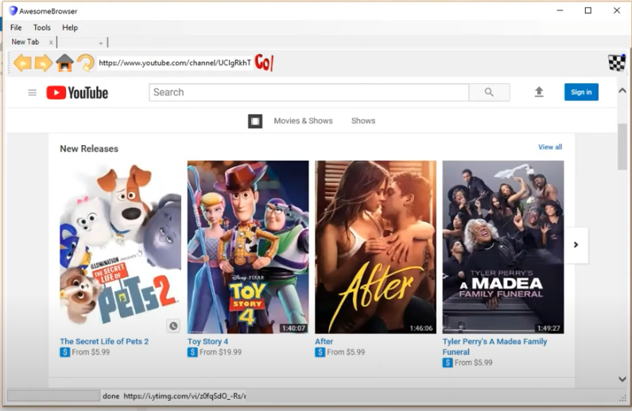

# Web-Browser
<h1>Self-Made Web Browser</h1>
Please refer to the link for display:
https://youtu.be/Q8jyicQkn44

The course CPSC2713 in Auburn University is intended to give us a hands-on experience with an object-oriented visual programming language. We started from a single buttom to the whole software. By the end of this course we successfully developed a three-tier, graphical, event-driven desktop application, a web browser, using an object-oriented language (C#) and SQL database while incorporating essential software construction methodologies.

  Functionalities:

<ol>
  <li>
A Refresh button: when clicked the browser will refresh the current page 
</li>
  <li>
A Back button: Push the current link to the top of 'Forward links' stack Pop the new link from the 'Back links' stack, and navigate to it in the browser 
</li>
  <li>
A Forward button: Push the current link to the top of 'Back links' stack Pop the new link from the  'forward links' stack, and navigate to it in the browse 
</li>
  <li>
File -> New Tab (Ctrl + T):Create a new tab page, Add a new instance of the new user control you created to that tab page, Set the docking property of that control to “fill”.
</li>
  <li>
File -> Close Current Tab (Ctrl + W):Close currently selected tab.
</li>
  <li>
A Bookmark button: when clicked, the URL and Title of the current page will be added to the Bookmark table in the database if it does not already exist (use the Bookmark Manager to add the new bookmark to the database)
</li>
  <li>
Tools -> Manage History: When clicked create a new instance of the “History Manager Form” form and call ShowDialog()
</li>
  <li>
Tools -> Manage Bookmarks: When clicked create a new instance of the “Bookmark Manager Form” form and call ShowDialog()
</li>
  <li>
 History Manager(Search Button): When the user enters a phrase in the TextBox and clicks the Search Button, filter the list to show only the history items that contain the keyword(s) the user is searching for.
</li>
  <li>
 History Manager(Delete Button): When a user selects an item in the list, and clicks on the Delete Button, the item will be deleted from the database and the list will be refreshed.
</li>
  <li>
History Manager(Clear Button): When the user clicks on this button, the system will delete all history items from the database table and will refresh the list.
</li>
  <li>
 Bookmark Manager(Search Button): When the user enters a phrase in the TextBox and clicks the Search Button, filter the list to show only the bookmark items that contain the keyword(s) the user is searching for.
</li>
  <li>
 Bookmark Manager(Delete Button): When a user selects an item in the list, and clicks on the Delete Button, the item will be deleted from the database and the list will be refreshed.
</li>
  <li>
Tools -> Clear History: When selected, the system will delete all history items from the database table.
</li>
</ol>

